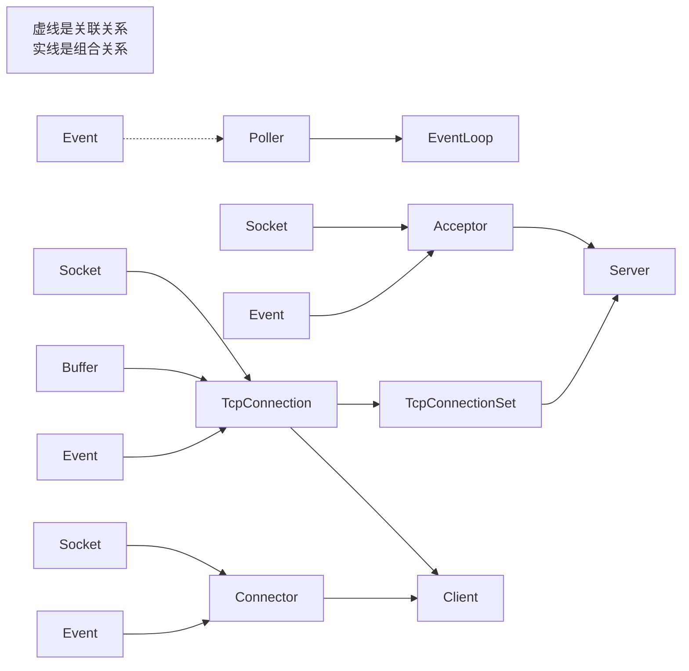

生命周期关系图

```mermaid
graph LR;
note[虚线是关联关系<br>实线是组合关系]
Event3[Event]-.->Poller
Poller-->EventLoop
Socket-->TcpConnection
Buffer-->TcpConnection
Event-->TcpConnection
Socket1[Socket]-->Acceptor
Event1[Event]-->Acceptor
Socket2[Socket]-->Connector
Event2[Event]-->Connector
Acceptor-->Server
TcpConnection-->TcpConnectionSet
TcpConnectionSet-->Server
TcpConnection-->Client
Connector-->Client
```
