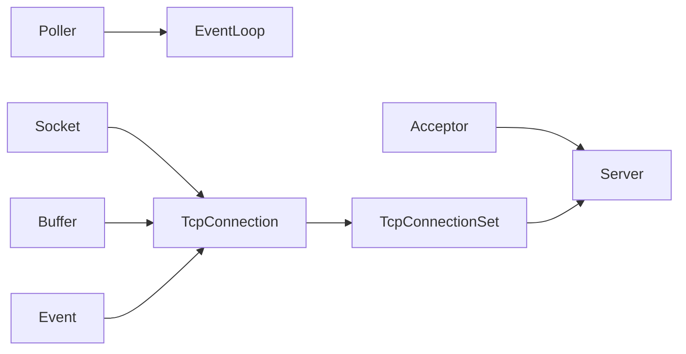

生命周期关系图

```mermaid
graph LR;
Poller-->EventLoop
Socket-->TcpConnection
Buffer-->TcpConnection
Event-->TcpConnection
Acceptor-->Server
TcpConnection-->TcpConnectionSet
TcpConnectionSet-->Server
```
